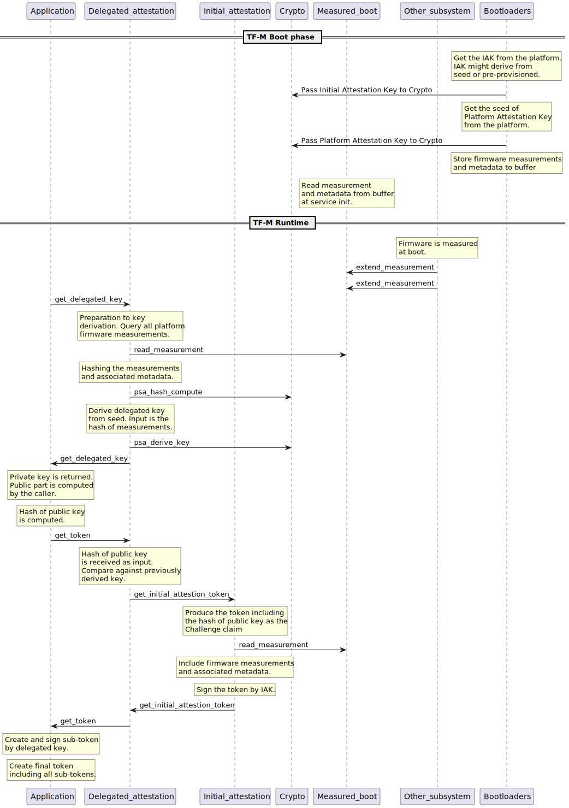

###############################################
Delegated Attestation Service Integration Guide
###############################################

************
Introduction
************

Delegated Attestation Service was mainly developed to support the attestation
flow on the ``ARM Confidential Compute Architecture`` (ARM CCA) [1]_. However,
it implements a generic model, which fits to other use cases as well. Delegated
attestation is a model where the responsibility of creating the overall
attestation token is split between different parties. The overall token is a
composition of sub-tokens, where each sub-token is produced by an individual
entity within the system. Each sub-token is signed with a different key, which
is owned by the sub-token producer. The signing keys are derived in a chain.
Each key is derived by the producer of the previous (in the chain) attestation
token. The sub-tokens must be cryptographically bound to each other, to make the
key chain back traceable to the initial attestation key (IAK), which is used
to sign the initial attestation token. The cryptographic binding is achieved
by including the hash of the public key in the challenge claim of the
predecessor attestation token. The IAK or seed of it is provisioned at chip
manufacturing time. The rest of the signing keys in the chain are derived at
runtime. The main functionalities of the delegated attestation service are:

- Provide an API to derive a delegated attestation key.
- Provide an API to make the previous attestation token (e.g.: initial or
  platform token) queryable.

The entity at the end of the chain is responsible to compose the final
attestation token. This can be achieved by nesting the tokens or adding a
wrapper around the sub-tokens.

Usage example:

- Initial or platform attestation token is produced by the Initial
  Attestation service. Signed by IAK.
- Additional attestation token can be produced by any entity in the system.
  An entity can request a signing key via the
  ``tfm_delegated_attest_get_delegated_key`` call. The previous attestation
  token can be queried via the ``tfm_delegated_attest_get_token`` call. The
  input is the hash of the corresponding public key, which is included as
  the challenge claim.

.. code-block:: restructuredtext

    Composed / final attestation token:
   +----------------------------------------------------------------+
   |                                                                |
   |    Delegated Attestation         Platform Attestation          |
   |    Token                         Token                         |
   |    +---------------+             +-------------------+         |
   |    | Challenge     |     +------>| Hash of delegated |         |
   |    | ...           |     | B     | public key as     |    W    |
   |    | Delegated     |     | i     | challenge         |    r    |
   |    | public key    |     | n     | ...               |    a    |
   |    | ...           |     | d     | ...               |    p    |
   |    | Other claims  |     | i     | Other claims      |    p    |
   |    +---------------+     | n     +-------------------+    e    |
   |    | Signed with   |     | g     | Signed with       |    r    |
   |    | delegated     |-----+       | IAK               |         |
   |    | private key   |             |                   |         |
   |    +---------------+             +-------------------+         |
   |                                                                |
   +----------------------------------------------------------------+

Dependencies
============

Delegated Attestation service has the following dependencies on other secure
services within TF-M:

- Crypto service: Crypto service has access to the pre-provisioned built-in
  keys. It derives a signing key on request.
- Initial Attestation service: Provides the initial attestation token.
- Measured boot: Provides the firmware measurements and associated metadata.
  They are used to compute the input for the key derivation.

.. code-block:: restructuredtext

                                                        +-------------------+
                                                        | Initial           |
                 +---------------+                      | Attestation       |
                 |               | <--------------------| Service           |
    <------------|               |   get_token()        |                   |
    get_key()    |               |                      +-------------------+
                 |               |
                 | Delegated     |                      +-------------------+
                 | Attestation   | <--------------------| Crypto            |
                 | Service       |   key_derivation()   | Service           |
                 |               |                      |                   |
                 |               |                      +-------------------+
                 |               |
    <------------|               |                      +-------------------+
    get_token()  |               | <--------------------| Measured          |
                 +---------------+   read_measurement() | Boot              |
                                                        | Service           |
                                                        |                   |
                                                        +-------------------+

Delegated Attestation flow diagram
==================================

Key derivation
==============

The system MUST have a pre-provisioned seed programmed at chip manufacturing
time. Several keys could be derived from this seed. The key derivation happens
in two phases:

- Boot phase: Done by the bootloader, BL1_1 on RSS platform. The input is
  the device lifecycle, hash of BL1_2 bootloader, etc.
- Runtime phase: Delegated attestation and crypto services are responsible
  for the derivation. Delegated attestation computes the inputs from
  firmware measurements and crypto service does the actual derivation.

Always the same key is derived until the firmware images (and thereby their
measurement - hash value is constant) are not changed. If any firmware image
gets updated or the device lifecycle has changed, then it will result in a
different delegated signing key than the previous one.

**************
Code structure
**************

The TF-M Delegated Attestation Service source and header files are located in
the current directory. The interfaces for the delegated attestation service are
located in the ``interface/include``. The headers to be included by
applications that want to use functions from the API is
``tfm_delegated_attestation.h`` and ``tfm_delegated_attest_defs.h``.

Service source files
====================

- ``delegated_attest.c`` : Implements core functionalities such as
  implementation of APIs. Interacts with dependent services to derive
  the signing key and get the initial attestation token.
- ``tfm_delegated_attestation_api.c``: Implements the secure API layer to
  allow other services in the secure domain to request functionalities
  from the delegated attestation service using the PSA API interface.
- ``delegated_attest_req_mngr.c``: Includes the initialization entry of
  delegated attestation service and handles service requests in IPC model.

Delegated Attestation Interfaces
================================

The TF-M Delegated Attestation service exposes the following interfaces:

.. code-block:: c

    psa_status_t
    tfm_delegated_attest_get_delegated_key(psa_ecc_family_t ecc_curve,
                                           uint32_t         key_bits,
                                           uint8_t         *key_buf,
                                           size_t           key_buf_size,
                                           size_t          *key_size,
                                           psa_algorithm_t  hash_algo);
    psa_status_t
    tfm_delegated_attest_get_token(const uint8_t *dak_pub_hash,
                                   size_t         dak_pub_hash_size,
                                   uint8_t       *token_buf,
                                   size_t         token_buf_size,
                                   size_t        *token_size);

Related compile time options for out of tree build
==================================================
- ``TFM_PARTITION_DELEGATED_ATTESTATION``: To include the delegated attestation
  secure partition and its services, its value should be ON. By default, it is
  switched OFF.

- ``TFM_EXTRA_MANIFEST_LIST_FILES``: <tf-m-extras-repo>/partitions/
  delegated_attestation/delegated_attestation_manifest_list.yaml

- ``TFM_EXTRA_PARTITION_PATHS``: <tf-m-extras-repo>/partitions/
  delegated_attestation

- ``DELEG_ATTEST_DUMP_TOKEN_AND_KEY``: If turned ON then the derived delegated
  attestation key and the delegated attestation token is printed to the console.

************
Verification
************

Regression test
===============

Regression test suite is implemented in ``test/delegated_attest_test.c``.

References
==========

.. [1] https://developer.arm.com/documentation/DEN0096/A_a/?lang=en

--------------

*Copyright (c) 2022, Arm Limited. All rights reserved.*
