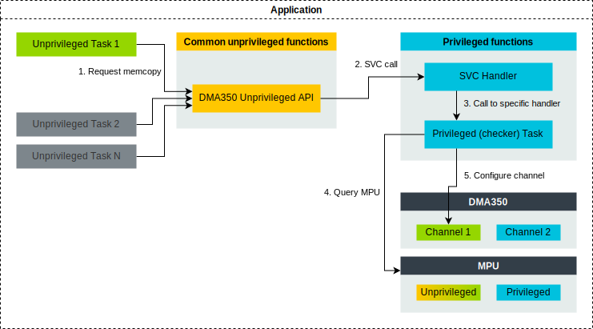

############################
DMA-350 privilege separation
############################

The DMA-350 component consists of multiple channels, that can work
independently. These channels can be limited in both privilege and security.
When Non-secure access is granted to a DMA channel, the device automatically
limits the generated transfers to Non-secure. The same happens, when
unprivileged access is granted to a channel: the transfers will be limited to
unprivileged. However, there is a risk in the latter: If a system does not
utilize a system MPU to filter DMA accesses to the memory system, unprivileged
DMA channels can access to privileged data, and this results in security issues.

For such systems, if unprivileged tasks need access to the DMA, Arm recommends
the following, both for Secure and Non-secure applications:

#.  Set all DMA channels to privileged in the DMA controller
#.  Grant read-write accesses in MPU for the DMA channel register blocks for the
    unprivileged task
#.  Create a privileged (checker) task, that can be called from an unprivileged
    task (eg. via SVC call):

    a.  Use this privileged task to provide a limited API towards the
        unprivileged task
    b.  The privileged task can check the parameters and the addresses that
        would be accessed by the DMA operation. Based on the result, it can
        setup the DMA channel with the requested parameters or deny it
        completely

.. note::

    *  It is assumed that the Operation System provides a method to define MPU
       configurations as a per task basis, and always updates the MPU
       configuration for the current running unprivileged task. When the
       privileged (checker) task is called, the current MPU configuration -
       which is of the (unprivileged) caller task - should remain intact. This
       way, when the privileged (checker) task queries the MPU for unprivileged
       access with an address, the result will be from the perspective of the
       (unprivileged) caller task.
    *  The API provided by the privileged task should be limited, as checking
       complex configuration would require simulating the inner workings of the
       DMA itself.
    *  In case dynamic assignment of the channels is required, special care must
       be taken when reconfiguring the privilege or security of a channel. To
       prevent information leakage and privilege escalation, reconfiguration of
       a channel can only happen on an idle channel, and it also results in
       resetting the registers of that channel.

The following diagram shows an example call flow from Unprivileged Task 1 to
configuring the DMA channel:

#.  Unprivileged Task 1 calls the DMA-350 unprivileged API
#.  DMA-350 unprivileged API function makes an SVC call with an arbitrary, but
    unique SVC number (this must be different from SVC services that the RTOS
    already offered.)
#.  SVC Handler forwards the call to the DMA-350 specific handler
#.  Privileged (checker) task extracts the parameters from the caller stack and
    query the MPU:

    a.  Requested channel register for read access
    b.  Requested source address range for read access
    c.  Requested destination address range for read-write access

#.  If all query pass, configure the requested channel. If not, return an error
    status and this error information propagate back to the unprivileged task 1.

Some example functionality the unprivileged API can provide:

*  Memory copy, memory move, endian swap copy
*  Triggers for application specific configurations: The DMA is configured by
   privileged tasks; API only to start/stop/query the given channel

The following list demonstrates how are unprivileged accesses are checked and
blocked.

#. Direct from an unprivileged task: Denied by the built-in check of the DMA.
   It will result in either security violation or RAZ/WI (read as zero, write
   ignored), depending on DMA configuration
#. Access through the API, request for a channel that is not dedicated to the
   Blocked by the privileged (checker) task. When the request is made, the task
   queries the MPU, whether there is unprivileged read access for the channel
   registers, using the TTT instructions
#. Access through the API, with requested read/write addresses in privileged
   region: Blocked by the privileged (checker) task. When the request is made,
   the task can queries the address range (that would be affected by the
   operation) in the MPU for unprivileged access, using the TTT instructions
   or the cmse_check_address_range intrinsic
#. Access through the API, with requested read/write addresses in unprivileged
   channel register block region: Blocked by the target DMA channel. The checker
   layer will allow the transaction, as in the MPU, the target address is set to
   unprivileged. The transaction will be generated as an unprivileged transfer,
   but as the target DMA channel is set to privileged in the DMA controller, it
   will block the access. It will result in either security violation or RAZ/WI,
   depending on DMA configuration

Software developers must also consider:

*  How to inform the unprivileged task that a DMA operation is completed - The
   DMA interrupt handle could utilize RTOS event communication to send an event
   to the unprivileged task to indicate that the DMA operation is completed.
*  How errors are handled - If a DMA operation results in an error, potentially
   the error handler (execute in privileged state) can inform the unprivileged
   task via RTOS message/event queue.

To support these communications, the unprivileged APIs and the SVC services for
setting up DMA-350 might require RTOS specific parameters to define the OS
events / message queue to use.

*Copyright (c) 2022, Arm Limited. All rights reserved.*
