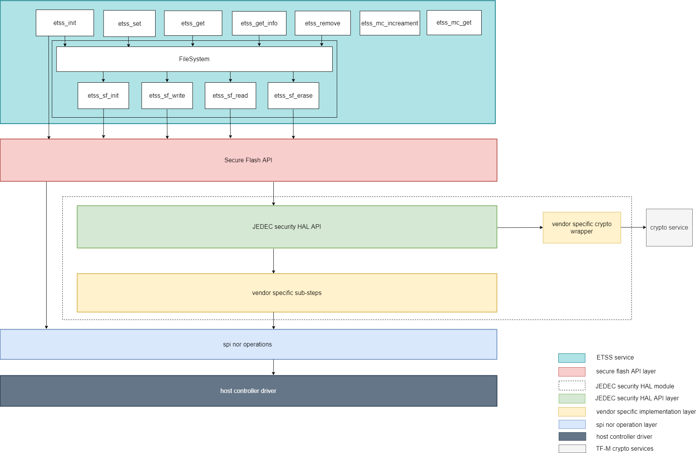

###############################
external trusted secure storage
###############################

********
Abstract
********

This document mainly introduces the motivation of adding External Trusted Secure
Storage(ETSS) partition and the corresponding design proposal.

************
Introduction
************
A secure storage solution is very important when storage is external to MCU.
Macronix and other Flash memory suppliers have developed several security memory
products, and three major products are RPMC, Authentication Flash, and a more
full featured secure Flash like Macronix ArmorFlash.

RPMC is a memory device which provides non-volatile monotonic counters for
replay protection.

Authentication Flash mainly provides authentication mechanism to enhance the
security of data transmition.

Compared to previous two security Flash, the full featured secure Flash performs
authentication, encryption along with a full range of additional security
features. This secure Flash generally equips with hardware crypto engine with
advanced cryptography algorithms, physically unclonable function(PUF),
non-volatile monotonic counters, TRNG, key storage and management module, etc.
Secure Flash always provides protection against hardware attacks such as
probing, side-attack and fault injection.

In addition, the communication channel between host MCU/SoC and secure Flash is
protected by encryption, authentication, data scrambling, and frame sequencing
with monotonic counters, as shown in :ref:`secure communication channel between
host and secure Flash`.Besides, the independent secure sections configured with
specific security policy satisfies multi-tenant isolation.

Hence the secure Flash provides dependable defense against unauthorised access,
man-in-the-middle, replay, sniffing and other security threats.

.. _secure communication channel between host and secure Flash:

.. figure:: media/secure_communication_channel.png
   :align: center

   Secure communication channel between host and secure Flash

More information about secure Flash can be extracted from Macronix ArmorFlash
product introduction [1]_ and the ArmorFlash Whitepaper [2]_ for understanding
the secure memory architectures in emerging electronic systems.

**************
Design concept
**************
Overview
========
An ETSS partition is developed as a PSA RoT secure partition to provide external
trusted secure storage services based on above external security memory products
features. These three major security memory products are collectively referred
to as secure Flash in the following.
The ETSS partition includes several software components, which are listed below:

   +-------------------------+------------------------------------------------+
   | **Component name**      | **Description**                                |
   +=========================+================================================+
   | service API             | The service interface of ETSS partition to the |
   |                         | NSPE/SPE                                       |
   +-------------------------+------------------------------------------------+
   | Service module          | This module handles the service calls from     |
   |                         | NSPE/SPE                                       |
   +-------------------------+------------------------------------------------+
   | Secure Flash framework  | This module is the generic framework of secure |
   | module                  | Flash driver.                                  |
   +-------------------------+------------------------------------------------+

The interaction between these different components is illustrated in the
following block diagram:

.. figure:: media/block_diagram_of_etss_components.png
   :align: center

   Block diagram of the different components of ETSS partition.

The more detailed architecture of ETSS service with secure Flash framework is
shown below.

   Layered architecture of ETSS service with secure Flash framework

ETSS services can be accessed by other services running in SPE, or by
applications running in the NSPE.

ETSS services are split into two independent parts: provisioning and deployment.
A secure Flash provisioning process should be performed before deployment to set
up binding keys and grant access rights. The ``etss_secure_flash_provisioning``
service is provided to perform secure Flash provisioning in the manufacture
process. The specific provisioning implementation may vary with security memory
vendors and platforms.

After provisioning, ETSS is ready for providing deployment services with
external secure Flash.
The available services vary with security memory products.
There are three types of services:

- Secure storage
- Replay protection monotonic counter manipulation
- Extra services based on extended security features(such as PUF, true random
  number generator, etc.)

The actually available services are based on the security features of backend
secure Flash.

Taking following scenarios for example:

- The external security memory product is just an RPMC, only monotonic counters
  manipulation services are available.
- The external security memory product is a full featured secure Flash, it
  supports security read, security program, has a certain number of monotonic
  counters and other extra security functions. Then the holistic ETSS services
  may be available.

In the current implementation, ETSS partition just copies the concise filesystem
implemented in TF-M ITS partition.
As this filesystem doesn't involve access rights management, to support
secure Flash multi-zone isolation, it needs to declare separate filesystem
contexts for each secure Flash isolated partition.
The detailed layout of each isolated partition is set up by the specific
secureflash_layout.h of each secure Flash.
For each specific security memory products, the secureflash_layout.h should be
configured according to the application scenario.

If user needs to support two and more security memory products simultaneously
in ETSS partition, then corresponding secure Flash instances and filesystem
contexts should be declared.

The secure Flash framework module aims to generalize the application interface
of secure Flash driver, and cover different vendors' security memory products.
It can be intergated with different software platforms and OSes, and consists of
four parts: secure Flash API layer, secure Flash common layer, vendor specific
layer and crypto service interface.

- Secure Flash API layer: This layer mainly manages application's access
permission based on application identification and pre-provisioned information.
The implementation of this layer varies accross software platforms and OSes.
Here integrated with TF-M, this layer manages access permissions based on client
id, and derives parameters passed to secure Flash common layer.

- Secure Flash common layer: This layer abstracts secure Flash operations, and
calls binding vendor specific operations.

- Vendor specific layer: The specific implementation of different secure Flash
vendors and JEDEC recommended implementation, it depends on upper layer's choice
to bind with JEDEC recommended implementation or vendor specific implementation.
This layer calls tf-m crypto services via crypto service interface to perform
cryptographic operations, then assemble packets sent to external secure Flash
and parse packets received from external secure Flash.

If vendors tend to contribute projects with hiding some critical source codes,
then these critical parts can be released as library files. These library files
may be maintained in another git repository because of different license,
vendors should explain how to access these library files in relevant documents.

Code structure
==============

The code structure of this partition is as follows:

tf-m-extras repo:

``partitions/external_trusted_secure_storage/etss_partition/``

- ``etss.yaml`` - ETSS partition manifest file
- ``etss_secure_api.c`` - ETSS API implementation for SPE
- ``etss_req_mngr.c`` - Uniform IPC request handlers
- ``external_trusted_secure_storage.h`` - ETSS API with client_id parameter
- ``external_trusted_secure_storage.c`` - ETSS implementation, using secureflash_fs as back-end
- ``secureflash_fs/`` - Secure Flash filesystem
- ``external_secure_flash/`` - Secure Flash filesystem operations
- ``secureflash/`` - Backend secure Flash framework for ETSS service
    - ``secureflash.c`` - Secure Flash API layer interfaces implementation
    - ``secureflash.h`` - Secure Flash API layer interfaces
    - ``secureflash_common/`` - Secure Flash common layer of secure Flash framework
    - ``crypto_interface/`` - Crypto service interface of secure Flash framework
    - ``JEDEC_recommend_impl/`` - Reserved JEDEC recommend uniform implementation
    - ``macronix/`` - Macronix specific implementation
    - ``secureflash_vendor2/`` - Reserved vendor2 specific implementation
    - ``secureflash_vendor3/`` - Reserved vendor3 specific implementation
- ``template/`` - Templates of underlying hardware platform specific implementation of ETSS service

``interface/``

- ``include/etss/etss_api.h`` - ETSS API
- ``include/etss/etss_defs.h`` - ETSS definitions
- ``src/etss/etss_ipc_api.c`` - ETSS API implementation for NSPE

``suites/etss``

- ``non_secure/etss_ns_interface_testsuite.c`` - ETSS non-secure client interface test suite
- ``secure/etss_s_interface_testsuite.c`` - ETSS secure client interface test suite
- ``secure/etss_s_reliability_testsuite.c`` - ETSS secure interface reliability test suite

tf-binaries repo:

``macronix/commonBinaryMX75/``

- ``mx75_armor_lib.a`` - The binary library of Macronix mx75 series ArmorFlash

.. note::

The ``suites/etss/`` provides ETSS service test suites, this folder can be
integrated with ``tf-m-tests/test/suites`` for testing.

***********************
Configuration and Build
***********************

Currently, only GNUARM is supported to build as an out-of-tree Secure Partition.

To test etss service, put ``external_trusted_secure_storage/interface/include/etss``
under ``trusted-firmware-m/interface/include``, put ``external_trusted_secure_storage/interface/src/etss``
under ``trusted-firmware-m/interface/src``.
Add corresponding command within ``trusted-firmware-m/interface/CMakeLists.txt``.
Besides, to integrate ETSS testsuites sample with ``tf-m-tests``, put the
``suites/etss`` folder under ``tf-m-test/test/suites``, add following command to
``tf-m-test/test/suites/CMakeLists.txt``.

.. code-block:: cmake

    add_subdirectory(suites/etss)

    and add the following command to ``tf-m-test/app/CMakeLists.txt``

.. code-block:: cmake

    $<$<BOOL:${TFM_PARTITION_EXTERNAL_TRUSTED_SECURE_STORAGE}>:${INTERFACE_SRC_DIR}/etss/etss_ipc_api.c>

build with the following commands.

.. code-block:: bash

    cd <TF-M base folder>
    cmake -S . -B cmake_build -DTFM_PLATFORM=stm/stm32l562e_dk \
    -DTFM_TOOLCHAIN_FILE=toolchain_GNUARM.cmake  -DTEST_S=ON -DTEST_NS=ON \
    -DTFM_EXTRA_MANIFEST_LIST_FILES=<tf-m-extras-abs-path>/partitions/external_trusted_secure_storage/etss_manifest_list.yaml \
    -DTFM_EXTRA_PARTITION_PATHS=<tf-m-extras-abs-path>/partitions/external_trusted_secure_storage/etss_partition \
    -DTFM_PARTITION_EXTERNAL_TRUSTED_SECURE_STORAGE=ON -DTFM_ISOLATION_LEVEL=2
    cmake --build cmake_build -- install

.. note:: <tf-m-extras-abs-path>:The absolute path of tf-m-extras folder.
          The corresponding trusted-firmware-m version is v1.4.0.
          At the moment, ETSS partition has been tested with STM32L562E_DK
          development board. As this development board hasn't carried any
          secure Flash. An external secure Flash is connected to MCU by fly
          lines.

**************
Future changes
**************

Currently, the implementation of secure Flash provisioning service is primitive,
and only suitable for developer mode. In the future, a proper secure
Flash provisioning implementation will be provided.

Besises, the following works are underway:
 - Optimize secure Flash sessions management.
 - Add access rights management features to secure Flash filesystem.

References
----------

.. [1] `ArmorFlash product instruction <https://www.mxic.com.tw/en-us/products/Pages/ArmorFlash.aspx>`_

.. [2] `ArmorFlash Whitepaper <https://www.macronix.com/en-us/products/Documents/Secure%20Memory%20Architectures%20in%20Emerging%20Electronic%20Systems.pdf>`_

-----------

*Copyright (c) 2021-2022, Macronix International Co. LTD. All rights reserved.*
*SPDX-License-Identifier: BSD-3-Clause*

