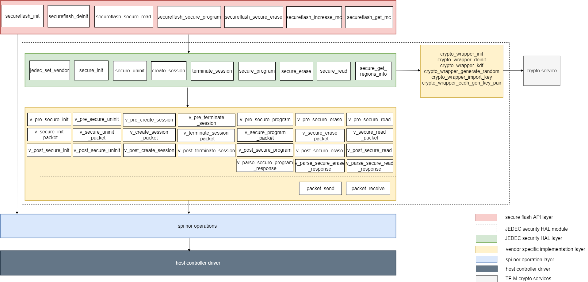

###############################
external trusted secure storage
###############################

********
Abstract
********

This document mainly introduces the motivation of adding External Trusted Secure
Storage(ETSS) partition, correpsonding implementation and integration guidance.

************
Introduction
************
A secure storage solution is very important when storage is external to MCU.
Macronix and other Flash memory suppliers have launched several security storage
products, including RPMC, Authentication Flash, and a more full featured secure
Flash like Macronix ArmorFlash.

RPMC is a memory device which provides non-volatile monotonic counters for
replay protection.

Authentication Flash mainly provides authentication mechanism to enhance the
security of data transmition.

Compared to previous two security Flash, the full featured secure Flash performs
authentication, encryption along with more comprehensive security features. This
secure Flash generally contains hardware crypto engine with advanced cryptography
algorithms, non-volatile monotonic counters, key storage and management module,
optional physically unclonable function(PUF), TRNG, etc.

Secure Flash inherently provides reliable protection against hardware attacks including
probing, side-attack and fault injection.

In addition, the communication channel between host MCU/SoC and secure Flash is
protected with encryption, authentication, data scrambling, and frame sequencing
with monotonic counters, as shown in :ref:`secure communication channel between
host and secure Flash`. Put simply, the cipher text encrypted by secure Flash is
always different each time even repeatedly reading from the same address/area of
secure Flash.

Therefore, secure Flash provides dependable defense against unauthorised access,
man-in-the-middle, replay, sniffing and other security threats.

.. _secure communication channel between host and secure Flash:

.. figure:: media/secure_communication_channel.png
   :align: center

   Secure communication channel between host and secure Flash

Besides, separate secure regions binding with respective root keys
and specific security policy provide hardware isolation for multi-tenancy.

.. _secure Flash supports multi-tenant isolation:

   Independentn secure Flash regions support multi-tenant isolation

More information about secure Flash can be found from Macronix ArmorFlash
product introduction [1]_ and ArmorFlash Whitepaper [2]_ for understanding
the secure memory architectures in emerging electronic systems.

Futhermore, JEDEC have published the JESD261 standard [3]_, titled Serial NOR Security
Hardware Abstraction Layer(HAL). This standard defines a software layer to provide
a uniform interface for cryptographic operations on compliant Secure Flash devices.

JESD261 HAL enables manufacturer-neutral communication with secure Flash devices.
Security features introduced in JESD261 include session-based communication, secure program
and erase operations, as well as partitioning of the Flash device into protected regions,
that are available through an application interface. JESD261 defines rules for implementing
this application interface to simplify the use and evaluation of these common security features
accross secure Flash vendors.

Accordingly, an important update on this release version of ETSS partition is the implementation
of JEDEC security HAL API.

**************
Design concept
**************
Overview
========
An ETSS partition is developed as a PSA RoT secure partition to provide external
trusted secure storage services based on external secure Flash features.(Three
types of security memory products mentioned above are generally referred to as
secure Flash from here.)

ETSS partition consists of the software components listed below:

   +-------------------------+------------------------------------------------+
   | **Component name**      | **Description**                                |
   +=========================+================================================+
   | Service API             | The service interface of ETSS partition to the |
   |                         | NSPE/SPE                                       |
   +-------------------------+------------------------------------------------+
   | Service module          | This module handles the service calls from     |
   |                         | NSPE/SPE                                       |
   +-------------------------+------------------------------------------------+
   | Secure Flash framework  | This module is the generic framework of secure |
   | module                  | Flash driver.                                  |
   +-------------------------+------------------------------------------------+

The interaction between these different components is illustrated in following
block diagram:

.. figure:: media/block_diagram_of_etss_components.png
   :align: center

   Block diagram of the different components of ETSS partition.

ETSS services can be accessed by other services running in SPE, or by applications running in the NSPE.

A secure Flash provisioning process should be performed to configure each secure Flash region's
security attributes, share binding keys between host MCU/SoC and secure Flash, and grant applications'
access rights prior to being put into use. The ``etss_secure_flash_provisioning`` service is
implemented to facilitate secure Flash provisioning in the manufacture process.

Specific secure Flash provisioning information can be assigned while calling
``etss_secure_flash_provisioning`` service. As the provisioning of secure Flash is not
addressed in JESD261 standard, and the specific provisioning implementation process
may vary with security memory vendors and platforms. In this design the specific secure
Flash provisioning is implemented by each vendor in vendor specific implementation layer as shown below.

   Block diagram of secure Flash provisioning.

For a quick start, secure Flash provisioning developer mode is activated by turning
``ETSS_PROV_DEVELOPER_MODE`` on. A const ``PROVISIONING_BLOB`` array contains
template provisioning data could be used to simplify secure Flash provisioning procedure.

Here the ``application id`` items of ``APP_INFO`` table are in accordance with the
``test_ns_nsid_table`` of tf-m-tests/app/tfm_nsid_map_table.c and client id of
``TFM Secure Client Partition``.

After provisioning, the secure Flash is ready for depoyment. The available ETSS services
vary with secure Flash features. Currently ETSS partition mainly covers two types of services:

- Secure storage
- Monotonic counter manipulation

Taking following scenarios for example:

- The external secure Flash is just an RPMC, only monotonic counters
  manipulation services are available.
- The external secure Flash is a full featured secure Flash, it not only
  supports security read, security program, but also has a certain number of
  monotonic counters and other extra security functions. Then more ETSS services
  are available.

The architecture of ETSS service with secure Flash framework is as follow.

.. figure:: media/ETSS_with_Secure_Flash_Framework.png
   :align: center

   Layered architecture of ETSS service with secure Flash framework

In current implementation, ETSS partition just borrows the concise filesystem
from TF-M ITS partition.
As this filesystem doesn't involve access rights management, to support
secure Flash multi-zone isolation, it needs to declare separate filesystem
contexts for each secure Flash isolated partition.
The detailed layout of secure Flash isolated partitions is configured by the specific
secureflash_layout.h of each secure Flash.
The secureflash_layout.h should be configured according to application scenarios
for each security memory product.

As mentioned above, JEDEC has published the JESD261 standard which defines a
software layer to unify interactions to secure Flash that are related to
cryptographic security functionality.

In this design, the implementation of JEDEC security HAL is integrated in the
secure Flash framework module of ETSS partition. The block diagram of secure
Flash framework module is shown below.

   Block diagram of secure Flash framework with JEDEC security HAL.

The secure Flash framework is subdivided into three parts:

- Secure Flash API layer

This layer mainly manages applications' access permission
based on application identification and pre-provisioned applications' access rights.
The specific representation of application identification varies accross software
platforms and OSes. Here integrated with TF-M, this layer manages access permissions
based on client id.

- JEDEC security HAL module

JEDEC security HAL module could be compiled for use within different OSes and software platforms.
This module consits of JEDEC security HAL API layer and vendor specific implementation layer.

JEDEC security HAL API layer implements the interfaces defined in JEDEC JESD261 standard.
And calls the pre-binding specific sub-steps implemented in vendor specific implementation layer.
Here integrated in TF-M platform, the JEDEC security HAL API layer calls TF-M crypto services via
vendor specific crypto wrapper functions.

Vendor specific implementations layer provides specific sub-steps implementaion required by
JEDEC security HAL API layer. In addition, this layer also includes the specific implementation
of secure Flash provisioning which should be performed before deployment.

- Spi nor operation layer

The implementation of SPI NOR flash normal commands and operations, such as read id, write enable, etc.

If vendors willing to contribute their specific implementation intend to keep critical source
codes secret, then these critical parts can be released as library files.
These library files are maintained in tf-binaries git repository protected with different
license, and vendors had better explain how to integrate these library files in relevant
documents to facilitate use.

Code structure
==============

The code structure of this partition is as follows:

tf-m-extras repo:

``partitions/external_trusted_secure_storage/etss_partition/``

- ``etss.yaml`` - ETSS partition manifest file
- ``etss_req_mngr.c`` - Uniform IPC request handlers
- ``external_trusted_secure_storage.h`` - ETSS API with client_id parameter
- ``external_trusted_secure_storage.c`` - ETSS implementation, using secureflash_fs as back-end
- ``secureflash_fs/`` - Secure Flash filesystem
- ``external_secure_flash/`` - Secure Flash filesystem operations
- ``secureflash/`` - Backend secure Flash framework for ETSS service
    - ``secureflash.c`` - Secure Flash API implementation
    - ``secureflash.h`` - Header file for secure Flash API layer
    - ``TG424_3/`` - Containing JEDEC security HAL implementation
        - ``JEDEC_security_HAL/`` - JEDEC security HAL API layer
            - ``jedec_security_hal.c`` - JEDEC security HAL API implementation
            - ``jedec_security_hal.h`` - Header file for JEDEC security HAL API layer
            - ``queue.c`` - Queue operations implementation
            - ``queue.h`` - Queue operations definition
            - ``crypto_wrapper.h`` - Header file for crypto wrapper functions
            - ``vendor_security_impl.h`` - Header file for vendor specific implementation of JEDEC security HAL sub-steps 
        - ``vendor_impl/`` - Flash vendors' specific implementation
            - ``macronix/`` - The specific implementations for Macronix secure Flash products
                - ``armorflash_mx75/`` - The specific implementations for Macronix MX75 ArmorFlash
                - ``armorflash_mx78/`` - The specific implementations for Macronix MX78 ArmorFlash
            - ``vendor_template/`` - Reserved vendor specific implementation for reference
            - ``vendor_provisioning_impl.h`` - Header file for vendor specific secure flash provisioning operations
            - ``vendor_secureflash_defs.h`` - Vendor secure flash definitions
            - ``vendor_secureflash.h`` - Header file containing vendors' secure flash informations
    - ``spi_nor_flash/`` - Spi nor flash normal operations
        - ``spi_nor.h`` - Header file for spi nor flash operations
        - ``spi_nor.c`` - Spi nor flash operations
    - ``platform/`` - Platform porting files 
        - ``include/`` - Header files provideing interfaces which should be ported on platforms
            - ``spi_nor_hc.h`` - Provide interfaces for driving spi nor flash host controller
            - ``plat_secure_flash.h`` - Provide interfaces for storing and getting secure flash provision information
        - ``template/`` - Examples implementations of the interfaces defined in above header files for reference, which should be altered by actual platform specific implementations
            - ``spi_nor_hc.c`` - Example implementation of spi nor flash host controller driver with STM32L562E_DK evaluation board
            - ``plat_secure_flash.c`` - Example implementation of storing and getting secure Flash provisioning information with STM32L562E_DK evaluation board
			- ``Driver_SPI.h`` - Header file for SPI driver
            - ``low_level_spi.c`` - SPI driver implementation ported on STM32L562E_DK evaluation board
			
``partitions/external_trusted_secure_storage/interface/``

- ``include/etss/etss_api.h`` - ETSS API
- ``include/etss/etss_defs.h`` - ETSS definitions
- ``src/etss/etss_ipc_api.c`` - ETSS API implementation for NSPE
- ``src/etss/etss_secure_api.c`` - ETSS API implementation for SPE

``partitions/external_trusted_secure_storage/suites``

- ``non_secure`` - ETSS non-secure client interface test suite
- ``secure`` - ETSS secure client interface test suite

tf-binaries repo:

``macronix/commonBinaryMX75/``

- ``mx75_armor_lib.a`` - The binary library for Macronix MX75 ArmorFlash

``macronix/commonBinaryMX78/``

- ``libmx78_armor_lib.a`` - The binary library for Macronix MX78 ArmorFlash
- ``libmx78_armor_provision_lib.a`` - The binary library for Macronix MX78 ArmorFlash provisioning

***********************
Configuration and Build
***********************

Currently, only GNUARM is supported to build ETSS partition as an out-of-tree Secure Partition.

The ``partitions/external_trusted_secure_storage/suites`` provides ETSS service test suites, this folder can be integrated
with ``tf-m-tests`` for testing.

Prior to testing ETSS services, secure Flash provisiong should be performed. Take Macronix ArmorFlash as example,
for a quick start, please enable ``ETSS_PROV_DEVELOPER_MODE`` mode and set ``SECUREFLASH_PROVISION``
to 1. Then the template secure Flash provisioning blob ``PROVISIONING_BLOB`` defined in ``mx78_armor.c``
would be used for secure Flash provisioning, the application ids defined in this blob are in
accrodance with ``SECURE_FLASH_CLIENTx_ID`` defined in
``external_trusted_secure_storage/etss_partition/secureflash/vendor_impl/macronix/armorflash_mx78/secureflash_layout.h``.

For other vendors' secure Flash products, please refer to secure Flash vendors'
instruction document about specific secure Flash provisioning implementation.

build with the following commands for secure Flash provisioning, here also take Macronix ArmorFlash as example.

.. code-block:: bash

    cd <TF-M base folder>
    cmake -S . -B cmake_build_etss_prov -DTFM_PLATFORM=<TFM_PLATFORM> \
    -DTFM_TOOLCHAIN_FILE=toolchain_GNUARM.cmake -DTFM_PARTITION_LOG_LEVEL=TFM_PARTITION_LOG_LEVEL_DEBUG \
    -DTFM_EXTRA_MANIFEST_LIST_FILES=<tf-m-extras-abs-path>/partitions/external_trusted_secure_storage/etss_manifest_list.yaml \
    -DTEMP_TFM_EXTRA_PARTITION_PATHS=<tf-m-extras-abs-path>/partitions/external_trusted_secure_storage \
    -DTFM_EXTRA_CONFIG_PATH=<tf-m-extras-abs-path>/partitions/external_trusted_secure_storage/etss_partition/etss_config.cmake \
    -DSECUREFLASH_TYPE=macronix/armorflash_mx78 \
    -DSECUREFLASH_PROVISION=1 -DETSS_PROV_DEVELOPER_MODE=1 \
    -DTFM_PARTITION_EXTERNAL_TRUSTED_SECURE_STORAGE=ON \
    -DCONFIG_TFM_SPM_BACKEND="IPC"
    -DCRYPTO_PSA=ON
    cmake --build cmake_build -- install

After finishing secure Flash provisioning, build with the following commands for
etss non-secure test suite testing.

.. code-block:: bash

    cd <TF-M base folder>
    cmake -S . -B cmake_build_etss_ns_test -DTFM_PLATFORM=stm/stm32l562e_dk \
    -DTFM_TOOLCHAIN_FILE=toolchain_GNUARM.cmake -DTFM_PARTITION_LOG_LEVEL=TFM_PARTITION_LOG_LEVEL_DEBUG \
    -DTFM_EXTRA_MANIFEST_LIST_FILES=<tf-m-extras-abs-path>/partitions/external_trusted_secure_storage/etss_manifest_list.yaml \
    -DTEMP_TFM_EXTRA_PARTITION_PATHS=<tf-m-extras-abs-path>/partitions/external_trusted_secure_storage \
    -DTFM_EXTRA_CONFIG_PATH=<tf-m-extras-abs-path>/partitions/external_trusted_secure_storage/etss_partition/etss_config.cmake \
    -DSECUREFLASH_TYPE=macronix/armorflash_mx78  -DTFM_PARTITION_EXTERNAL_TRUSTED_SECURE_STORAGE=ON \
    -DCONFIG_TFM_SPM_BACKEND="IPC" \
    -DEXTRA_NS_TEST_SUITE_PATH=/home/a/workspace1/TF-M/trustedfirmware-m/tf-m-extras/partitions/external_trusted_secure_storage/suites/non_secure \
    -DTEST_NS_ETSS=ON -DEXTRA_NS_TEST_SUITE=ON -DTFM_NS_MANAGE_NSID=ON -DCRYPTO_PSA=O

build with the following commands for etss secure test suite testing.

.. code-block:: bash

    cd <TF-M base folder>
    cmake -S . -B cmake_build_etss_s_test -DTFM_PLATFORM=stm/stm32l562e_dk \
    -DTFM_TOOLCHAIN_FILE=toolchain_GNUARM.cmake -DTFM_PARTITION_LOG_LEVEL=TFM_PARTITION_LOG_LEVEL_DEBUG \
    -DTFM_EXTRA_MANIFEST_LIST_FILES=<tf-m-extras-abs-path>/partitions/external_trusted_secure_storage/etss_manifest_list.yaml \
    -DTEMP_TFM_EXTRA_PARTITION_PATHS=<tf-m-extras-abs-path>/partitions/external_trusted_secure_storage \
    -DTFM_EXTRA_CONFIG_PATH=<tf-m-extras-abs-path>/partitions/external_trusted_secure_storage/etss_partition/etss_config.cmake \
    -DSECUREFLASH_TYPE=macronix/armorflash_mx78  -DTFM_PARTITION_EXTERNAL_TRUSTED_SECURE_STORAGE=ON \
    -DCONFIG_TFM_SPM_BACKEND="IPC" \
    -DEXTRA_S_TEST_SUITE_PATH=<tf-m-extras-abs-path>/partitions/external_trusted_secure_storage/suites/secure \
    -DTEST_S_ETSS=ON -DEXTRA_S_TEST_SUITE=ON -DCRYPTO_PSA=O
    cmake --build cmake_build_etss_s_test -- install

.. note:: <TFM_PLATFORM>: Please refer to TF-M build instructions [4]_ for ``TFM_PLATFORM`` options.

          <tf-m-extras-abs-path>: The absolute path of tf-m-extras folder.
          The corresponding trusted-firmware-m version is v1.7.0.
          At the moment, ETSS partition has been tested with ST STM32L562E_DK
          and Renesas EK-RA6M5 development board. As these development board
          hasn't carried any secure Flash. An external secure Flash is connected to MCU by fly
          lines.

References
----------

.. [1] `ArmorFlash product instruction <https://www.mxic.com.tw/en-us/products/Pages/ArmorFlash.aspx>`_

.. [2] `ArmorFlash Whitepaper <https://www.macronix.com/en-us/products/Documents/Secure%20Memory%20Architectures%20in%20Emerging%20Electronic%20Systems.pdf>`_

.. [3] `<https://www.jedec.org/standards-documents/docs/jesd261>`_

.. [4] `TF-M build instructions <https://tf-m-user-guide.trustedfirmware.org/building/tfm_build_instruction.html>`_

-----------

*Copyright (c) 2021-2023, Macronix International Co. LTD. All rights reserved.*
*SPDX-License-Identifier: BSD-3-Clause*

